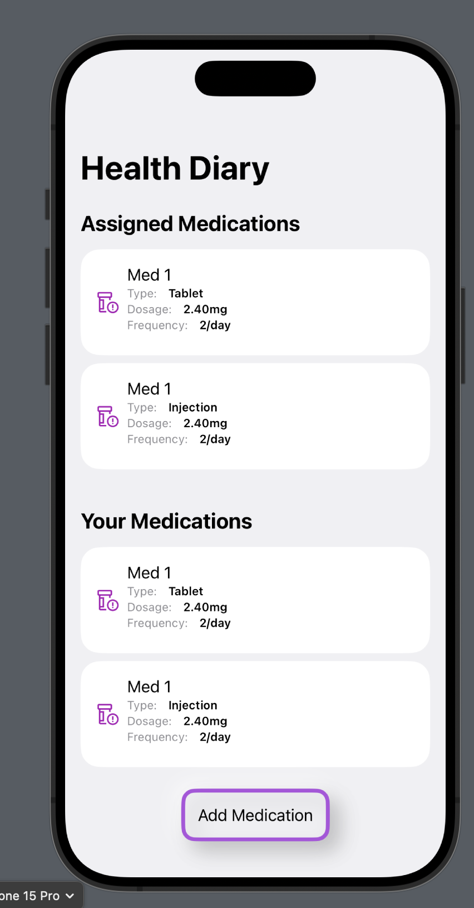
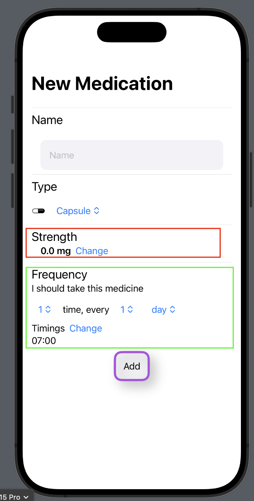
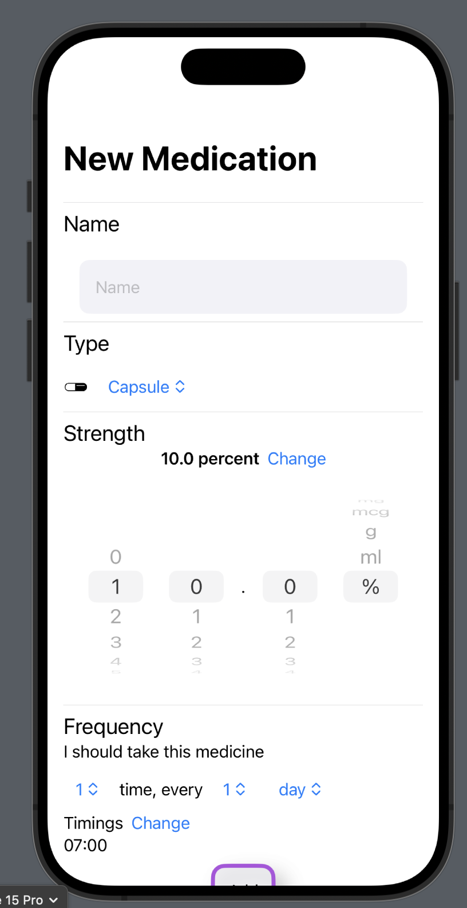
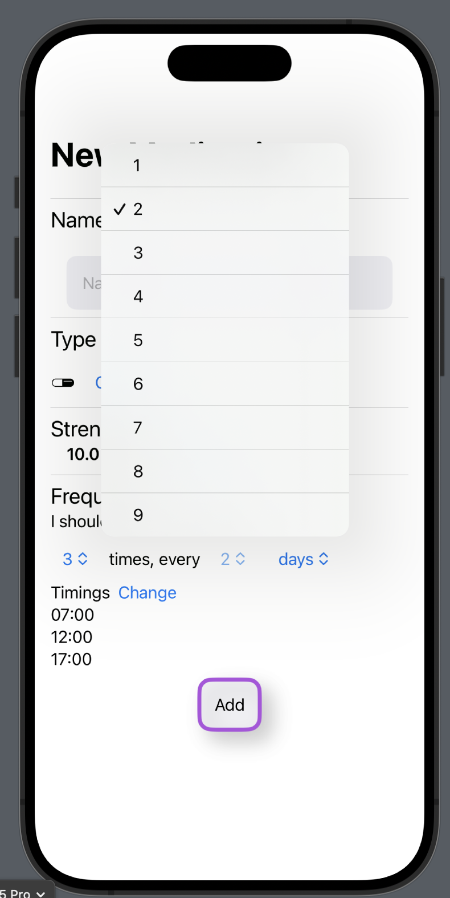
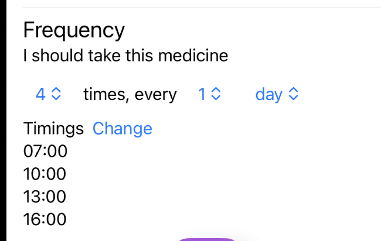
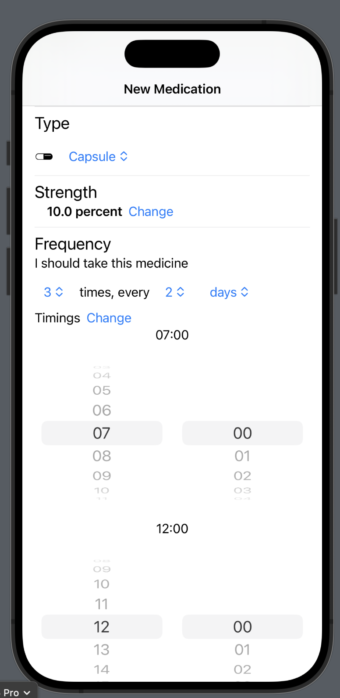

# Overview - Week 2

## Viewing scheduled medications
Recreated the view 10.1 from figma as closely as possible.

## Custom Meds
Currently, in Figma view 10.2: adding custom medications, the user inputs are all string fields. There's more appropriate elements i.e having a picker for the strength unit (as they're standardized), date picker for the time reminders and so on.

There's a few things to consider:
1. The type (or form) of the medication. This is defined as the *MedicationType* enum
2. The unit of strength (e.g micrograms, milligrams, etc) is defined as *ScheduledMedication.StrengthUnit*
3. The numerical value of the strength (a floating point number)
4. The frequency of the medication

How do we structure a statement like "**3 times a day, every two days**"?

I came up with this, AddMedView

User enters the name of the medication and its type. Then there's two components:
a. StrengthPicker (red border)
b. FrequencyPicker (green border)

### Picking the strength
Pressing 'change' on the strength value, seamlessly brings up a nice (I did my best lol) picker:

It's straightforawrd to, for example, set it to 10%.

### Picking the frequency
The components are SwiftUI pickers, tapping them brings up the picker menu. For example, tapping the '1' before the day lets the user change it to 'every 2 days':

#### Timings
Now, we need to tackle the timings. Suppose medication is to be taken twice in a given interval. We need to:
1. provide some reasonable default values and
2. make it apparent and easy enough to change them

We can represent one timing as two numbers: the hour and the minute. We define ScheduledTime for this purpose.
```swift
struct FrequencyPicker: View {
    struct ScheduledTime: Hashable{
        var hour = 7
        var minutes = 0
        var timeString: String {
        //this returns the time in a string of the form "12:04"
            return "\(hour.paddingUpTo(2)):\(minutes.paddingUpTo(2))"
            }
    }
    ...
```
Now changing a given timing is easy enough: we can just have two pickers: for the hours and the minutes. 
Can we provide some nice default values? Assuming reasonable waking hours as 7-22, we can easily calculate some. By specifying 4 times to take the medication, four timings instantly appear:

Tapping the 'change' button intuitively makes every timing modifiable:

*Note: This obviously can/will be improve with feedback. For now the aim is to make additions as functional as possible.*

### EventKit API
Apple describes how to define recurring events [here](https://developer.apple.com/documentation/eventkit/creating_a_recurring_event).
In short, we need a start date and EKRecurrenceFrequency. Frequency above is defined using EventKit types, so it should be easy to add them as events.
This will be tackled next week.

## Conclusion
The custom medication view (10.2 figma) is functional, with the 'Add Med' button calling this backend function that contains all the information of the custom medication.
```swift
func addedCustomMedication(med: CustomMedication, shouldFail: Bool = false)async->Result<Void, ServerError>{
```
This user-inputted information us guaranteed to be valid (i.e no parsing is required) and is defined as *CustomMedication*:
```swift
struct CustomMedication {
    var name: String = ""
    
    var type: MedicationType = .Capsule
    
    var StrengthPicked: StrengthPicker.StrengthPicked = .init()
    
    var enteredFrequency: FrequencyPicker.FrequencyPicked = .init()
}
struct StrengthPicked{
        var d0: Int = 0
        var d1: Int = 0
        var p0: Int = 0
        var unit: ScheduledMedication.StrengthUnit = .mg
        var number: Double {
            return Double("\(d0)\(d1).\(p0)")!
        }
        var asString: String {
            return "\(number) \(unit)"}
    }
struct FrequencyPicked{
        var timesToTakeMed: Int = 1
        var frequency: EKRecurrenceFrequency = .daily
//        in case there's an interval. For ex. if the frequency is daily and the interval is 1, it repeats every day. If the interval is 2, it repeats every 2 days.
        var frequencyInterval: Int = 1
        var times: [ScheduledTime] = Self.calculateDoseTimes(timesToTakeMed: 1)
    }
```